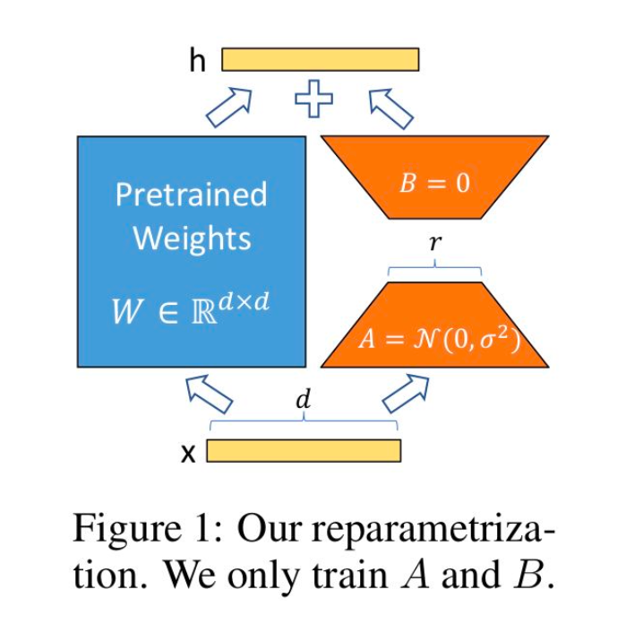
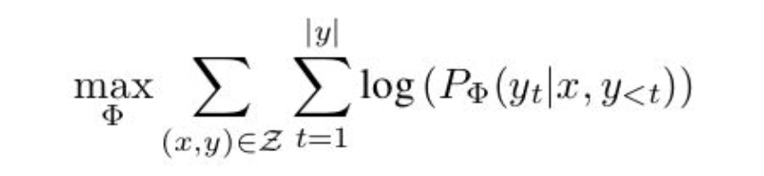

# LoRA 논문 정리

**LoRA의 핵심 idea**: Fine-tuning 과정에서 사전 학습이 완료된 파라미터 \( W_0 \)를 고정하고, low-rank decomposition 세팅의 새로운 파라미터를 학습시킨다.  

## Abstract
Low-Rank Adaptation (LoRA)는 사전 학습된 모델의 가중치를 고정한 상태에서, 각 변환 계층에 훈련 가능한 low-rank 분해 행렬(rank decomposition matrices)을 삽입하여 훈련 가능한 파라미터 수를 크게 줄이는 방법이다. 이를 통해 다음과 같은 이점이 있다:
- **훈련 가능한 파라미터 수**: 최대 **10,000배 감소**.
- **GPU 메모리 요구량**: 최대 **3배 감소**.

이로 인해 대규모 모델의 하드웨어 요구사항을 낮추고, 다양한 응용 작업에서 효율적으로 활용할 수 있다.

## Introduction

> _자연어 처리의 많은 응용은 대규모 사전 학습된 언어 모델을 다양한 하위 응용 작업에 적응시키는 데 의존한다. 이 적응은 주로 파인튜닝(fine-tuning)을 통해 이루어지며, 이는 모델의 모든 파라미터를 업데이트하는 방식이다._

파인튜닝은 효과적이지만, 모든 파라미터를 업데이트해야 하기 때문에 다음과 같은 문제점이 발생한다:
1. **리소스 요구량**: 훈련 과정에서 높은 메모리 및 계산 리소스가 필요.
2. **배포 및 저장 비용**: 각 하위 작업마다 별도의 파인튜닝된 모델을 저장 및 배포해야 함.

이에 따라, 일부 파라미터만 적응하거나 새로운 작업을 위한 외부 모듈을 학습하는 방법이 제안되었다. 이러한 방식에 영감을 받아, LoRA는 **가중치 변화가 본질적으로 낮은 순위를 가진다**는 가설에서 출발한다. 이를 기반으로 low-rank decomposition을 활용한 효율적인 적응 방법을 설계하였다.

---

### 장점

1. **효율적인 작업 전환**  
   모델 공유 시, 고정된 가중치 \( W_0 \)와 훈련된 행렬 \( A, B \)만 교체하면 되므로 **작업 전환 오버헤드**가 크게 감소한다.

2. **낮은 하드웨어 요구**  
   대부분의 파라미터에 대한 그래디언트를 계산하거나, 최적화 상태를 유지할 필요가 없어 GPU 메모리 요구량이 최대 **3배 감소**한다.

3. **추론 지연 없음**  
   훈련 완료 후, \( W_0 \)와 훈련 가능한 행렬을 결합하여 완전히 파인튜닝된 모델처럼 동작하며, 추가적인 **추론 지연(inference latency)** 을 도입하지 않는다.

## Problem Statement

완전한 파인튜닝은 사전 학습된 가중치 Φ_0로 초기화된 모델을, 조건부 언어 모델링 목표를 최대화하기 위해 그래디언트를 반복적으로 업데이트하는 방식이다:  

하지만 이 접근 방식에는 다음과 같은 문제점이 있다:
- **모든 파라미터 업데이트**: 각 하위 작업마다 ΔΦ를 별도로 학습하고 저장해야 한다. 이때, |ΔΦ|의 차원은 모델 크기와 같다.
- **비용 문제**: 대규모 사전 학습 모델의 경우, 이러한 독립적인 파인튜닝 인스턴스들을 저장 및 배포하는 것은 **비현실적**일 수 있다.

**해결 방법**: 계산 및 메모리 효율적인 low-rank representation을 사용하여 ΔΦ를 인코딩하는 방법을 제안한다.

### Aren't Existing Solutions Good Enough?

기존의 대표적인 적응 전략 두 가지는 다음과 같다:
1. **어댑터 레이어 추가**  
2. **입력 레이어 활성화 최적화**  

하지만, 두 접근법 모두 다음과 같은 한계가 있다:
- **어댑터 레이어의 추론 지연**:  
  어댑터 레이어는 순차적으로 처리되어야 하므로, 특히 모델 병렬성이 없는 시나리오에서 추론 시간이 증가한다.
  - 예: GPT-2 medium 모델을 단일 GPU에서 실행할 경우, 작은 병목 차원을 사용하더라도 지연 시간이 크게 증가한다.

- **프롬프트 최적화의 비효율성**:  
  프롬프트 튜닝은 시퀀스 길이의 일부를 적응에 사용하므로, 하위 작업을 처리할 시퀀스 길이가 줄어든다. 이는 프롬프트 튜닝의 성능을 제한한다.

## Our Method

### Low-Rank Parametrized Update Matrices

LoRA의 기본 가정은 다음과 같다:
- **사전 학습된 모델**의 본질적 차원이 낮다.
- 따라서, ΔW 를 low-rank representation으로 충분히 표현할 수 있다.

#### 정의  
Dense Layer의 가중치 행렬 W_0는 보통 full-rank를 가진다. LoRA는 이를 다음과 같이 업데이트한다:  
W_0 + ∆W = W_0 + BA
- \( W_0 \): 사전 학습된 가중치 (고정).  
- \( A, B \): 훈련 가능한 low-rank 매개변수.  

훈련 시:
1. \( W_0 \)는 고정되어 경사 업데이트를 받지 않는다.  
2. \( A \)는 무작위 가우시안으로 초기화, \( B \)는 0으로 초기화된다.  

#### 특징
- \( r << d_model\): r이 작을수록 메모리와 계산 비용이 절약된다.
- 초기화와 학습률 조정은 Adam 최적화와 호환 가능하다.

---

### Applying LoRA to Transformer

LoRA는 신경망에서 임의의 가중치 행렬에 적용할 수 있지만, Transformer에서는 주로 **self-attention 모듈**에 적용된다.  
- Transformer의 4개의 가중치 행렬 중, **W_q, W_k, W_v, W_o**에 적용.  
- MLP 모듈은 고정하여 메모리 효율성을 높인다.

이 접근 방식의 장점:
- VRAM 사용량을 최대 2/3까지 줄인다.  
- 사전 학습된 가중치를 고정된 상태로 유지하며, 여러 맞춤형 모델을 즉석에서 생성할 수 있다.

## Conclusion

LoRA는 다음과 같은 문제를 해결하는 효율적인 적응 전략이다:
1. **파인튜닝의 비효율성**: 하드웨어 요구사항과 저장 비용을 크게 감소.  
2. **추론 지연 문제**: 추가적인 지연 없이, 높은 모델 품질을 유지.  
3. **작업 전환 용이성**: 공유된 파라미터를 통해 손쉽게 작업 전환 가능.  

LoRA는 대규모 언어 모델 적응의 새로운 표준으로 자리 잡을 가능성이 크며, 효율성과 성능 면에서 중요한 이점을 제공한다.