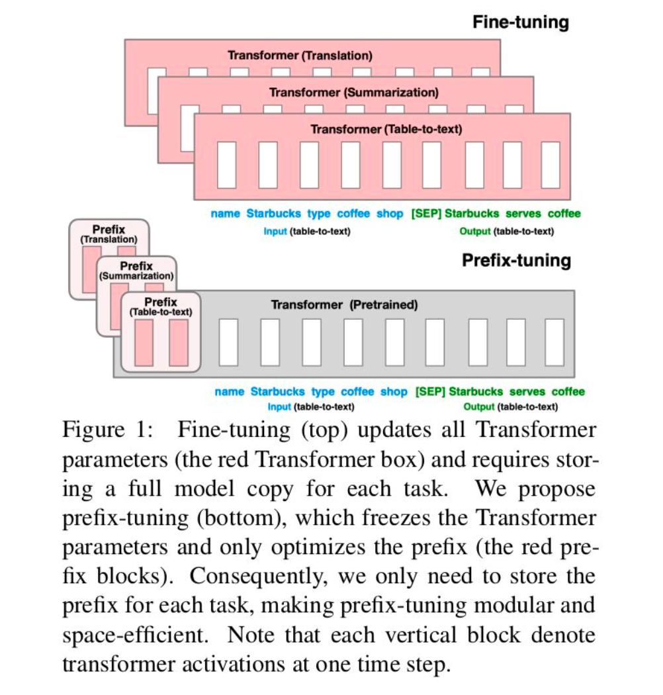
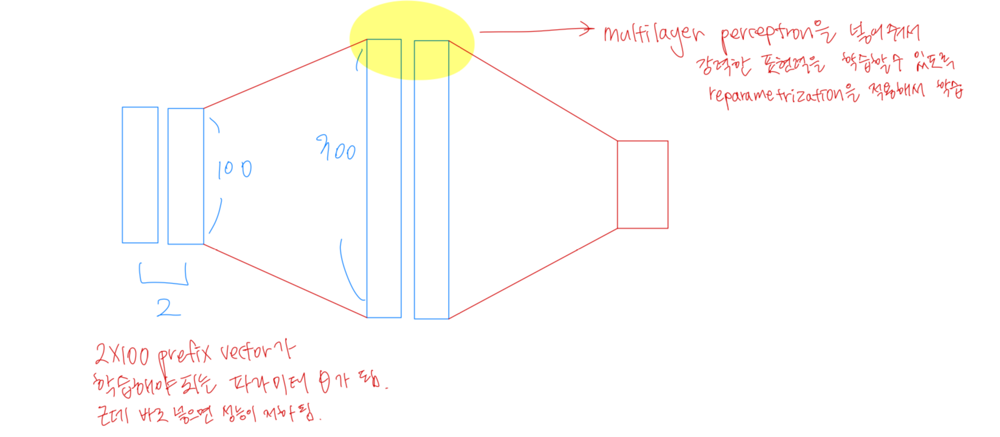

# Prefix-tuning 논문 정리

**Prefix-tuning의 핵심 아이디어**:  
Fine-tuning에서 사전 학습된 모델의 모든 파라미터를 업데이트하지 않고, 입력에 추가적인 작업별 연속 벡터(접두사)를 추가하여 해당 벡터만 학습하는 방식. 이를 통해 대규모 모델의 효율성을 높이고 저장 및 계산 비용을 크게 줄일 수 있다.  

---

## Abstract

사전 학습된 언어 모델(Pre-trained Language Model)을 활용한 하위 작업 수행에서 가장 일반적으로 사용되는 방법은 **fine-tuning**이다. 하지만 fine-tuning은 모든 모델 파라미터를 수정해야 하므로, 각 작업마다 전체 모델 복사본을 저장해야 하는 단점이 있다. 이를 해결하기 위해 **Prefix-tuning**이 제안되었다.  

**Prefix-tuning**은 사전 학습된 모델의 파라미터를 고정한 채, 작업별로 최적화할 수 있는 연속 벡터(prefix)만 추가로 학습한다. 이는 기존 fine-tuning에 비해 다음과 같은 장점을 가진다:  
- **훈련 가능한 파라미터 수**: 전체 모델 대비 0.1%만 학습으로도 비슷한 성능을 달성.  
- **저장 공간 효율성**: fine-tuning보다 1000배 적은 파라미터를 저장.  
- **일반화 성능 향상**: 적은 데이터 환경이나 새로운 주제에서 더 뛰어난 성능을 보임.  

## Introduction

대규모 사전 학습된 언어 모델(예: GPT-2, BERT)은 다양한 자연어 처리(NLP) 작업에 활용되고 있다. 이 모델들은 하위 작업에서 fine-tuning을 통해 파라미터를 학습하여 높은 성능을 발휘한다. 하지만 fine-tuning은 다음과 같은 단점이 있다:  

1. **리소스 요구량**  
   - 모든 파라미터를 업데이트하므로, 훈련 시 대규모 GPU 메모리와 계산 리소스를 필요로 한다.  
   - 예: GPT-2(7억 7천만 파라미터) 또는 GPT-3(1,750억 파라미터)를 작업별로 fine-tune하면, 메모리와 계산 요구가 기하급수적으로 증가한다.  

2. **저장 및 배포 비용**  
   - 각 작업마다 전체 fine-tuned 모델을 별도로 저장해야 하므로, 저장 공간과 배포 비용이 매우 크다.  

**Prefix-tuning**은 이러한 문제를 해결하기 위한 경량화된 대안이다.  
- 모든 모델 파라미터를 고정하고, 입력에 추가되는 연속적인 벡터(prefix)만 최적화한다.  
- 작업별로 학습된 접두사만 저장하면 되므로 저장 공간과 메모리 요구량이 크게 감소한다.  
- **모듈식 구조**를 가지므로, 하나의 모델로 여러 작업을 동시에 지원할 수 있다.  

## Problem Statement

### 조건부 생성 작업 정의  
- **입력**: x (맥락 또는 작업 컨텍스트).  
- **출력**: y (토큰의 연속열).  

본 논문에서는 두 가지 대표적인 조건부 생성 작업을 다룬다:  
1. **테이블-텍스트 생성 (Table-to-Text Generation)**  
   - 입력 x: 선형화된 데이터 테이블 (예: `"name: Starbucks | type: coffee shop"`).  
   - 출력 y: 해당 데이터를 설명하는 텍스트 (예: `"Starbucks는 커피를 제공합니다."`).  

2. **요약 (Summarization)**  
   - 입력 x: 기사 텍스트.  
   - 출력 y: 간략화된 요약 텍스트.  

이러한 작업에서는 입력 x와 출력 y의 관계를 학습하기 위해 사전 학습된 언어 모델이 사용되며, 기존 fine-tuning과의 차이를 설명하기 위해 **자동회귀 언어 모델**과 **인코더-디코더 아키텍처**를 소개한다.

### 자동회귀 언어 모델 (Autoregressive LM)  

Transformer 기반의 언어 모델에서는 다음과 같은 구조를 가진다:  
- z = [x; y]  : 입력   x  와 출력   y  의 연결된 시퀀스. 
- h_i: 시간 스텝 i에서의 활성값(activation).  
  - h_i = [h_i^1; h_i^2;...; h_i^n]: 각 Transformer 층에서 계산된 활성값의 연결.  
  -  h_i^j: i번째 시점에서 j번째 Transformer 층의 활성값.  
- pϕ(z i+1∣h≤i):i번째까지의 활성값을 기반으로 i+1번째 토큰의 확률 분포.  

### 인코더-디코더 아키텍처 (Encoder-Decoder Architecture)

이 구조는 조건부 생성 작업에서 p_ϕ(y|x)를 모델링하는 데 널리 사용된다:  
- **입력** x: 인코더에서 양방향으로 처리되어 정보가 압축된다.  
- **출력** y: 디코더에서 인코딩된 x와 이전 토큰들을 기반으로 자동회귀적으로 생성.  

## Prefix-Tuning  

**Prefix-tuning**은 fine-tuning의 대안으로, 입력에 접두사(prefix)를 추가하여 모델의 성능을 최적화하는 방법이다. 접두사는 작업별로 학습된 연속 벡터로, Transformer의 모든 활성값에 영향을 미친다.  

### 직관 (Intuition)  
프롬프팅(prompting)에서 영감을 받아, 적절한 컨텍스트를 제공하면 모델의 파라미터를 변경하지 않고도 원하는 결과를 유도할 수 있다는 직관에 기반한다.  
- 예: "Obama"라는 단어를 생성하도록 모델을 유도하려면, 컨텍스트로 "Barack"을 제공하면 높은 확률로 "Obama"를 생성할 가능성이 커진다.  
- 접두사는 연속 벡터로 최적화되며, 이는 실제 단어에 제한되지 않아 더 유연한 학습이 가능하다.  

### 방법 (Method)  
접두사 P_θ는 다음과 같이 Transformer 입력에 추가된다:  
- **Autoregressive LM**: z = [{PREFIX}; x; y].  
- **Encoder-Decoder**: z = [{PREFIX}; x; {PREFIX}'; y].  

접두사는 학습 가능한 매개변수로, 모델의 파라미터는 고정된 상태에서 최적화된다.  
- 학습 중 접두사는 입력의 왼쪽 컨텍스트로 작동하며, 모든 활성값에 영향을 미친다.  
- 결과적으로, 모델의 저장 공간 요구량이 크게 줄어든다.  

### 매개변수화 (Parametrization)  
접두사를 직접 업데이트하면 불안정한 최적화로 이어질 수 있으므로, 재매개변수화를 통해 이를 해결한다:  
- P_θ[i, :] = MLP_θ(P'_θ[i, :]).  
- 작은 행렬 P'_θ를 다층 퍼셉트론(MLP)으로 변환하여 접두사의 학습을 안정화한다.  

## Conclusion  
>prefix-tuning이란 전체를 파인튜닝하는게 아니라 앞에 prefix라고 붙이는 새로운 학습 가능한 어떤 vector를 만들어서 각 subtask별로 prefix만 재학습하는 형태. 

Prefix-tuning은 다음과 같은 문제를 해결한다:  
1. **저장 비용 감소**: fine-tuning보다 1000배 적은 파라미터를 저장.  
2. **훈련 비용 절감**: 전체 파라미터의 0.1%만 학습으로도 높은 성능 달성.  
3. **작업 전환 용이성**: 각 작업별 접두사만 교체하면 되므로, 저장 및 배포가 간편.  

이 방식은 자연어 생성 작업에서 fine-tuning의 실질적인 대안이 될 수 있으며, 특히 대규모 모델에서 효율성과 성능 면에서 뛰어난 가능성을 보여준다.  